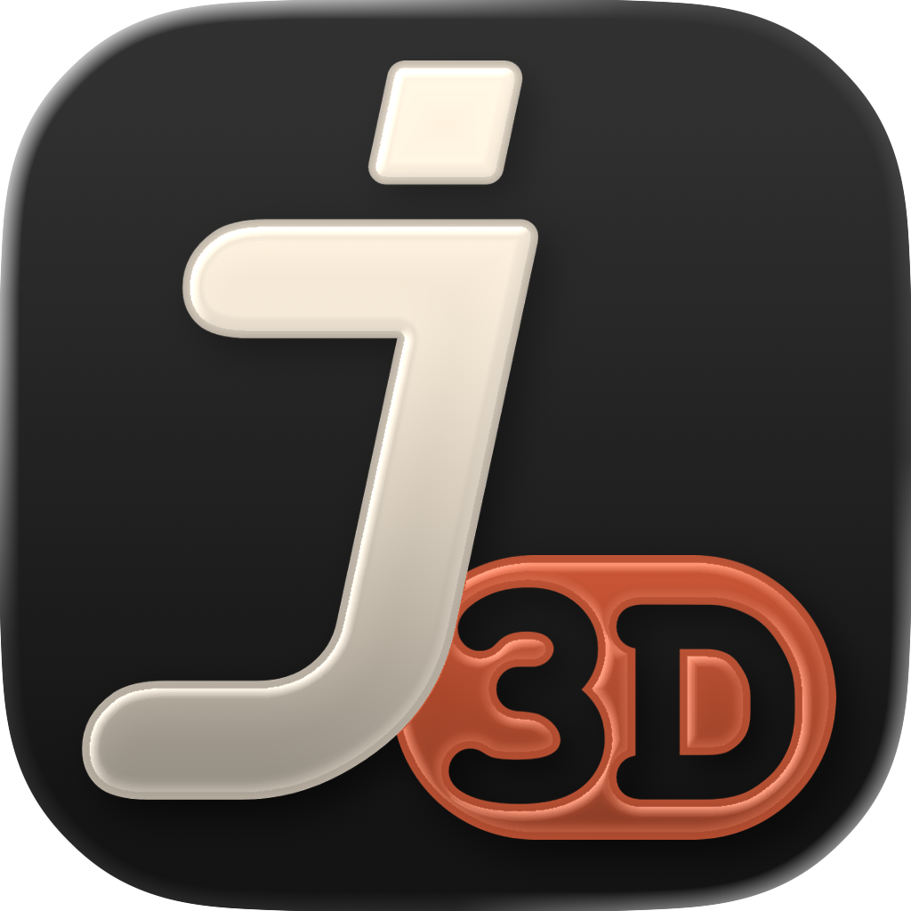

  

## Overview

j3D is a lightweight, Java-based 3D game engine built with LWJGL and OpenGL. Developed by DISCVRD Software, j3D provides a simple framework for creating 3D applications and games.

## Features

- **Modern OpenGL Integration**: Utilizes LWJGL for efficient OpenGL bindings
- **3D Model Loading**: Import and render OBJ format 3D models
- **Texture Support**: Load and apply textures to 3D models
- **Lighting System**: Basic lighting with ambient, diffuse, and specular components
- **Camera Controls**: First-person and orbital camera systems
- **Scene Management**: Organize and manage entities in scene graphs
- **Shader Support**: Custom GLSL shader support for advanced rendering effects
- **Performance Optimization**: Efficient rendering pipeline and resource management
- **Cross-Platform**: Works on any platform supporting Java and OpenGL

## Requirements

- Java 11 or higher
- Graphics card with OpenGL support
- Gradle build system

## Project Structure

- `src/main/java/com/discardsoft/j3D/` - Core engine and game logic
- `src/main/resources/` - Models, textures, and shaders
- `docs/` - Documentation and diagrams

## Documentation

For detailed documentation, please refer to the [j3D Manual](j3D_manual.md).

## License

Copyright © 2025 DISCVRD Software / DiscardSoft. All rights reserved.

## Credits

Developed by DISCVRD Software
